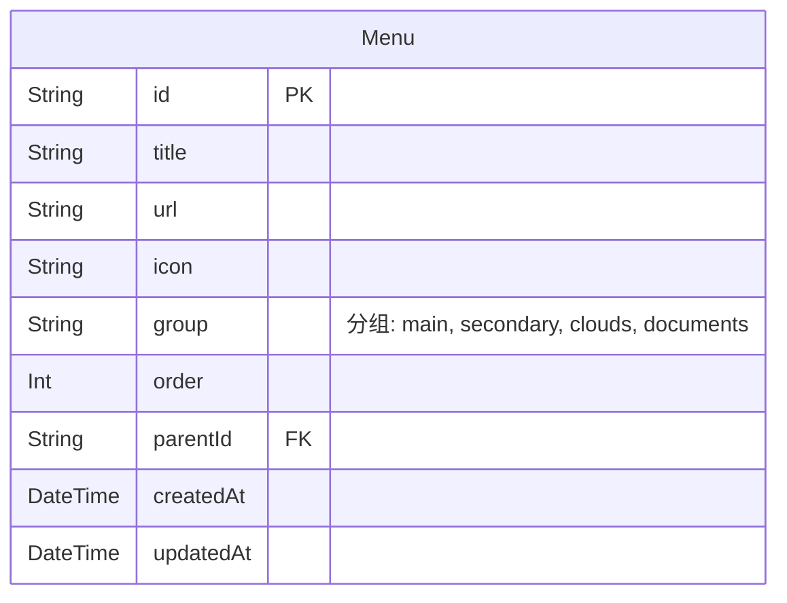

# 动态菜单 - 数据库设计文档

## 1. ER 图

## 2. 表结构 (Menu)

| 字段 | 类型 | 必填 | 默认 | 说明 |
| :--- | :--- | :--- | :--- | :--- |
| id | String | 是 | cuid() | |
| title | String | 是 | | 菜单显示名称 |
| url | String | 是 | "#" | 链接地址 |
| icon | String | 否 | | 图标标识符 (如 "LayoutDashboard") |
| group | String | 是 | "main" | 菜单所属分组 |
| order | Int | 是 | 0 | 排序，越小越靠前 |
| parentId | String | 否 | | 父菜单ID，支持无限极嵌套 |
