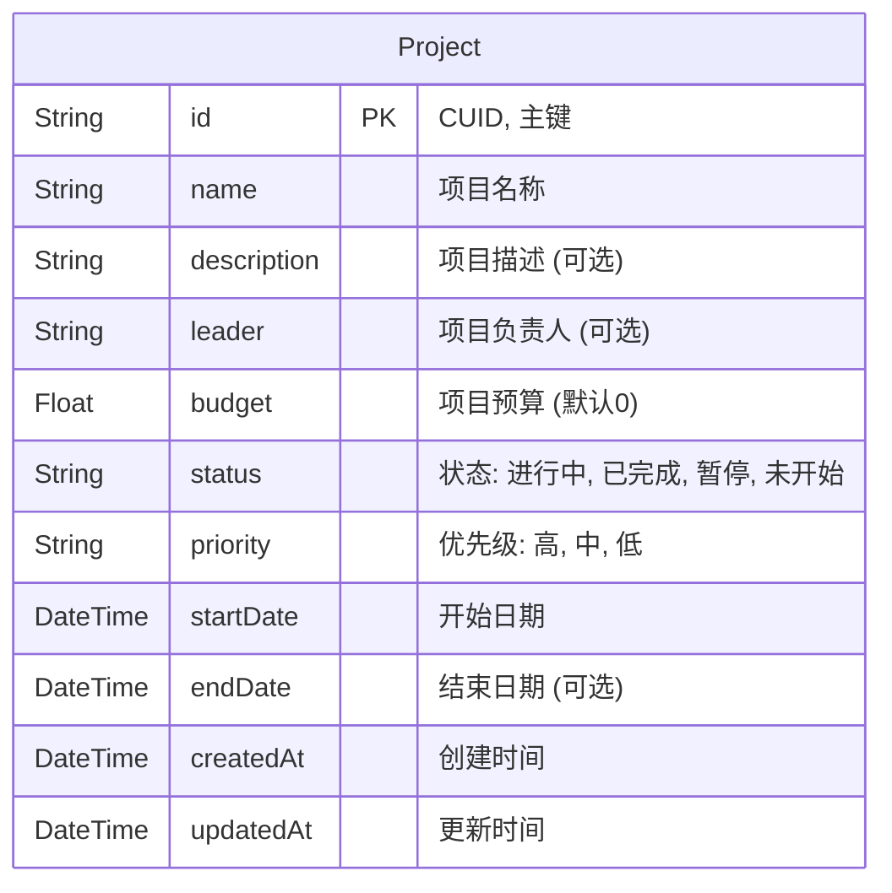

# 项目管理模块 - 数据库设计文档

## 1. 变更概述
本次变更旨在支持“项目管理”功能，新增 `Project` 表用于存储项目核心信息。

## 2. ER 图 (Mermaid)

## 3. 表结构详解 (Project)

| 字段名 | 数据类型 | 必填 | 默认值 | 约束/索引 | 业务说明 |
| :--- | :--- | :--- | :--- | :--- | :--- |
| **id** | String | 是 | cuid() | PRIMARY KEY | 系统自动生成的唯一标识符 |
| **name** | String | 是 | - | - | 项目的显示名称 |
| **description** | String | 否 | - | - | 项目详情文本，支持多行 |
| **leader** | String | 否 | - | - | 负责人姓名。未来可关联 User 表 |
| **budget** | Float | 否 | 0 | - | 项目预算金额，单位：元 |
| **status** | String | 是 | "进行中" | - | 状态枚举：`进行中`, `已完成`, `暂停`, `未开始` |
| **priority** | String | 是 | "中" | - | 优先级枚举：`高`, `中`, `低` |
| **startDate** | DateTime | 是 | now() | - | 项目计划开始时间 |
| **endDate** | DateTime | 否 | - | - | 项目计划结束时间 |
| **createdAt** | DateTime | 是 | now() | - | 记录创建时间 |
| **updatedAt** | DateTime | 是 | - | @updatedAt | 记录最后更新时间 |

## 4. 扩展性说明
*   **关联用户**：当前 `leader` 仅存储姓名字符串。未来若需权限控制，可将 `leader` 字段改为关联 `User` 表的外键 (`leaderId`)。
*   **多币种**：当前 `budget` 假设为单一基础货币（CNY）。若需支持多币种，需增加 `currency` 字段。
